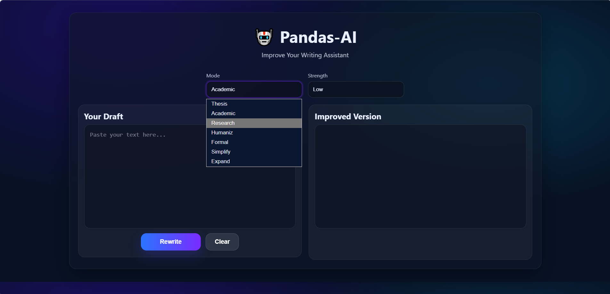

# Pandas-AI

Pandas-AI is a **local AI-powered academic rewriting assistant** designed for thesis, research papers, and academic writing.

It uses **Flask + Local LLM (Ollama)** to rewrite text in a more **formal, clear, and thesis-ready style**.

---

## Features

- Academic thesis/research-style rewriting
- Grammar suggestions
- Readability analysis
- Writing quality insights
- Clean web interface
- Runs completely **locally**

---

## Tech Stack

- Python
- Flask
- Ollama (Local LLM)
- HTML / CSS / JavaScript
- NLP tools

---

## Project Structure

## Screenshot

